# IBEX35 Directional Forecasting — ML & Sentiment Analysis

[](https://www.python.org/)
[](https://www.r-project.org/)
[](https://scikit-learn.org/)
[](ML_Colab/pipeline_ML_ibex35.ipynb)
[](TFM_Santiago_Lopez_Begines.pdf)
[](#license)

> **Master's Thesis** — *Santiago López Begines, PhD*
> *Prediction of IBEX35 closing direction via machine learning and financial news sentiment from GDELT*

## Overview

End-to-end pipeline for predicting the **daily directional movement** (up/down) of the Spanish IBEX35 index over a 20-year horizon (2004–2024). The project combines technical indicators, external market variables, and **sentiment scores extracted from >2,000 GDELT news batches** (~150 GB raw data) to assess whether news sentiment improves directional forecasting beyond pure price-based models.

**Bottom line**: LightGBM achieves **55–62% directional accuracy** — significantly above the 50% random baseline. Sentiment adds marginal, inconsistent improvement; technical indicators (RSI, moving averages, past returns) remain the dominant predictors. Deep learning (LSTM, GRU) offers no clear advantage over traditional gradient boosting.

---

## Pipeline Architecture

```mermaid
flowchart LR
    subgraph Data ["📥 Data Collection"]
        A1["IBEX35 + components\nYahoo Finance\n2004–2024"]
        A2["External markets\nS&P500, EuroStoxx\nOil, Gold, EUR/USD"]
        A3["GDELT news\n>2,000 ZIP files\n~150 GB"]
    end

    subgraph EDA ["🔬 EDA & Feature Engineering (R)"]
        B1["Fase 1–2\nTechnical indicators\nRSI, MACD, Bollinger\nMoving averages, volatility"]
        B2["Fase 3–4\nGDELT download\nParquet conversion\nSentiment scoring"]
        B3["Fase 5\nFeature integration\n~50 features selected"]
    end

    subgraph ML ["🤖 ML Pipeline (Python / Colab)"]
        C1["Baseline models\nARIMA · Prophet\nNaïve"]
        C2["Traditional ML\nXGBoost · LightGBM\nRandom Forest"]
        C3["Deep Learning\nLSTM · GRU · MLP"]
    end

    subgraph Eval ["📊 Evaluation"]
        D1["Accuracy · F1 · AUC\nMcNemar · Diebold-Mariano\nBootstrap CI (n=1000)"]
    end

    Data --> EDA --> ML --> Eval

    style Data fill:#1e3a5f,color:#fff,stroke:#3b82f6
    style EDA fill:#1e3a1e,color:#fff,stroke:#22c55e
    style ML fill:#3a1e1e,color:#fff,stroke:#ef4444
    style Eval fill:#3a2a1e,color:#fff,stroke:#f59e0b
```



---

## Key Results

| Model | Directional Accuracy | F1-Score | ROC-AUC |
|---|---|---|---|
| **LightGBM** (best) | **55–62%** | **0.57–0.63** | **0.58–0.64** |
| XGBoost | 53–59% | 0.55–0.60 | 0.55–0.61 |
| Random Forest | 52–57% | 0.53–0.58 | 0.54–0.60 |
| LSTM / GRU | 51–56% | 0.52–0.57 | 0.52–0.58 |
| ARIMA / Prophet | 50–52% | 0.50–0.53 | 0.50–0.53 |
| Naïve baseline | ~50% | ~0.50 | ~0.50 |

- **Sentiment impact**: marginal; GDELT tone improved accuracy by <2 pp in most conditions, and not consistently across bootstrap replicates (McNemar p > 0.05).
- **Top features**: RSI, short-term moving averages, lagged daily returns, intraday range.
- **Deep learning**: no statistically significant advantage over LightGBM despite higher complexity and training cost.

---

## Project Structure

```
.
├── TFM_Santiago_Lopez_Begines.pdf      # Master's thesis (full manuscript)
├── README.md
├── .gitignore
│
├── EDA_RStudio/                        # Exploratory analysis & preprocessing (R + Quarto)
│   ├── Fase1.qmd                       # Financial data loading & EDA
│   ├── Fase2.qmd                       # Feature engineering & correlation analysis
│   ├── Fase3.qmd                       # GDELT download & Parquet conversion
│   ├── Fase4.qmd                       # Sentiment scoring & feature integration
│   ├── Fase5.qmd                       # Time-series model development (ARIMA, Prophet)
│   ├── Fase6.qmd                       # Final validation & conclusions
│   └── code/
│       ├── R/                          # 25 modular R scripts (see below)
│       ├── py/                         # Python helpers called from R via reticulate
│       └── sh/                         # Shell scripts for batch GDELT processing
│
├── ML_Colab/                           # ML pipeline (Python, GPU-ready for Colab)
│   ├── pipeline_ML_ibex35.ipynb        # Main notebook — full pipeline
│   ├── environment.yml                 # Conda environment specification
│   ├── setup_colab.py                  # Auto-configuration for Google Colab
│   ├── setup_project.sh                # Project setup script
│   └── scripts/
│       ├── config.py                   # Global parameters (auto-detects Local/Colab/Kaggle)
│       ├── aux_functions.py            # Data loading, metrics, utilities
│       ├── modelos_ml.py               # XGBoost, LightGBM, RF, GRU, MLP
│       ├── lstm_models.py              # LSTM architectures
│       ├── evaluar_todos_modelos.py    # Comparative evaluation pipeline
│       ├── validate_lightgbm.py        # LightGBM-specific validation
│       ├── validation_main.py          # Test-set validation pipeline
│       ├── main_pipeline.py            # End-to-end pipeline runner
│       └── visualization.py            # Figures & training reports
│
└── Anexos/                             # Rendered annexes (HTML/PDF, not versioned)
    ├── Anexo 1. Documentacion_variables_financieras.pdf
    └── Anexo Fase1–6.*                 # Generated from .qmd (run to reproduce)
```

---

## R Scripts — `EDA_RStudio/code/R/`

### Initial configuration (00–06)
| Script | Purpose |
|---|---|
| `00.libraries.R` | Load all required R packages |
| `00.python_libraries.R` | Configure `reticulate` for Python–R integration |
| `01.general_functions.R` | General-purpose helper functions |
| `02.EDA_functions.R` | Exploratory analysis utilities |
| `03.transfer_py_to_r.R` | Python ↔ R object transfer |
| `04.financial_features.R` | Technical indicators: RSI, MACD, Bollinger Bands, MAs |
| `05.external_features.R` | External market variables: S&P500, EuroStoxx, commodities |
| `06.cleaning_features.R` | Outlier treatment and feature cleaning |

### GDELT processing (11–19)
| Script | Purpose |
|---|---|
| `11.web_scraping_download_gdelt_parallel.R` | Parallel download of >2,000 GDELT ZIP files |
| `convert_zip_to_parquet.R` | Batch ZIP → Parquet conversion |
| `12.filter_parquet_files.R` | Initial IBEX35-relevance filtering |
| `13.filter_script.R` | Advanced keyword-based filtering |
| `14.consolidate_filtered_batches.R` | Batch consolidation |
| `15.sentiment_score.R` | GDELT `tone` sentiment scoring |
| `16.analysis_sentiment_counts_ibex35.R` | News frequency analysis |
| `17.analysis_sentiment_intensity_ibex35.R` | Sentiment intensity analysis |
| `18.Lags_sentimientos.R` | Temporal lags for sentiment variables |
| `19.cleaning_sentiment.R` | Final sentiment variable cleaning |

### ML preparation (20–25)
| Script | Purpose |
|---|---|
| `20.feature_scaling.R` | Feature normalisation for ML |
| `21.forecasting_models.R` | ARIMA and Prophet time-series models |
| `22.evaluate_naive_models.R` | Naïve baseline evaluation |
| `23.compare_predictions.R` | McNemar & Diebold-Mariano statistical comparison |
| `24.scaling_validation_data.R` | Validation-set scaling |
| `25.verify_consistency.R` | Data integrity checks |

---

## Reproducing the Analysis

### Phase 1 — EDA & Feature Engineering (R)

```r
# Install packages first
source("EDA_RStudio/code/R/00.libraries.R")

# Run phases sequentially
quarto::quarto_render("EDA_RStudio/Fase1.qmd")   # Financial EDA
quarto::quarto_render("EDA_RStudio/Fase2.qmd")   # Feature engineering
quarto::quarto_render("EDA_RStudio/Fase3.qmd")   # GDELT download (~150 GB, 12–24 h)
quarto::quarto_render("EDA_RStudio/Fase4.qmd")   # Sentiment integration
quarto::quarto_render("EDA_RStudio/Fase5.qmd")   # Time-series models
quarto::quarto_render("EDA_RStudio/Fase6.qmd")   # Validation
```

> **Note**: Fase 3 downloads >2,000 GDELT archives (~150 GB). Running the remaining phases with pre-processed data skips this step.

### Phase 2 — ML Pipeline (Python)

**Option A — Google Colab (recommended, GPU)**

1. Upload `ML_Colab/` to Google Drive
2. Open `pipeline_ML_ibex35.ipynb` in Colab
3. Run `setup_colab.py` to configure paths
4. Execute cells sequentially

**Option B — Local environment**

```bash
# Create and activate conda environment
conda env create -f ML_Colab/environment.yml
conda activate tfm_ml

# Run full pipeline
python ML_Colab/scripts/main_pipeline.py

# Or run evaluation only
python ML_Colab/scripts/evaluar_todos_modelos.py
```

---

## Data & Reproducibility Notes

- **Raw GDELT data** (~150 GB) is not versioned. Download scripts are in `EDA_RStudio/code/R/11–14`.
- **Processed datasets** and **trained models** (`.joblib`, `.keras`) are excluded from the repo. Available upon request.
- **Full reproduction** requires approximately 12–24 h for the R pipeline and 4–8 h for GPU training on Colab.
- Financial data (IBEX35, S&P500, etc.) is downloaded automatically via Yahoo Finance in Fase 1.

---

## Tech Stack

| Layer | Tools |
|---|---|
| Financial data | `quantmod`, `TTR`, `yahoofinancer`, `yfinance` |
| GDELT processing | `arrow` (Parquet), `parallel`, custom R/shell scripts |
| Sentiment | GDELT `AvgTone` field, lagged aggregates |
| Feature engineering | `tidyverse`, `dplyr`, `lubridate` |
| Python–R bridge | `reticulate` |
| Time-series baselines | `forecast` (ARIMA), `prophet` |
| ML models | `scikit-learn`, `xgboost`, `lightgbm` |
| Deep learning | `tensorflow`, `keras` (LSTM, GRU, MLP) |
| Evaluation | `scipy` (McNemar), custom bootstrap CI |
| Reporting | Quarto (`.qmd`), `ggplot2`, `plotly` |

---

## Author

**Santiago López Begines, PhD**
Neuroscientist → Data Scientist
[Portfolio](https://slopezbegines.github.io/projects/ibex35-prediction/) · [GitHub](https://github.com/SLopezBegines) · [LinkedIn](https://linkedin.com/in/santibegines) · [ORCID](https://orcid.org/0000-0001-8809-8919)

---

## License

This project was submitted as a Master's Thesis. Code is made available for **educational and research purposes**. Any reuse requires attribution. Raw data sourced from Yahoo Finance (financial data) and GDELT (news data) under their respective terms of use.
